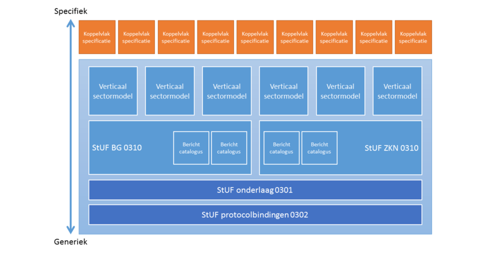

# StUF 3.01 familie
De StUF 3.01 familie is gebaseerd op de StUF 3.01 standaard en kent een aantal [horizontale en verticale sectormodellen](https://vng-realisatie.github.io/Standaarden/StUF-standaarden#stuf-sectormodellen). Daarnaast maken ook een aantal [koppelvlakken](https://vng-realisatie.github.io/Standaarden/StUF-standaarden#stuf-koppelvlakken) en de [protocolbindingen](./Protocolbindingen) deel uit van de StUF 3.01 familie.

Het onderstaande plaatje geeft een vereenvoudigd overzicht van de StUF 3.01 familie en de relaties tussen de verschillende onderdelen.

StUF 3.01, ook wel de StUF 3.01 onderlaag genoemd, maakt gebruik van voorzieningen die de protocolbindingen biedt. Op haar beurt stelt de StUF 3.01 onderlaag voorzieningen beschikbaar aan de horizontale sectormodellen waaraan de verticale sectormodellen weer voorzieningen kunnen onttrekken. De koppelvlakken maken vervolgens weer gebruik van de verticale sectormodellen en/of berichtencatalogi.
