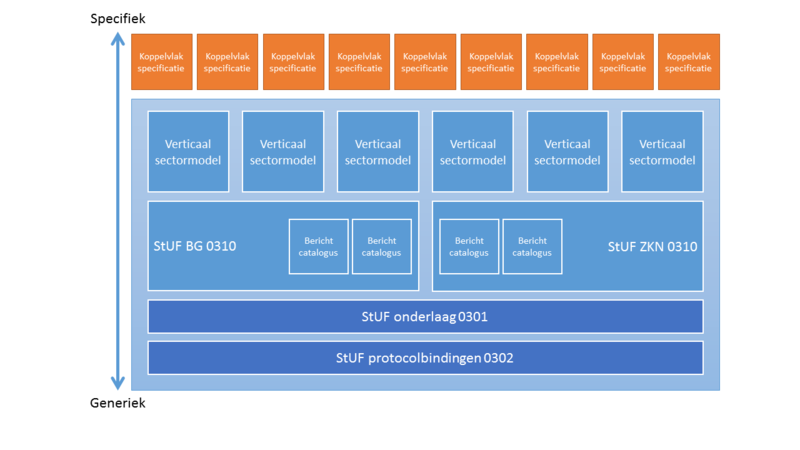

# StUF Berichtenstandaard

**Actuele versie**: 3.01

De Standaard Uitwisseling Formaat (StUF) is een berichtenstandaard en bevat de afspraken over de basisprincipes voor het uitwisselen van gegevens tussen applicaties in het gemeentelijke veld. StUF bevat zelf geen berichten maar wel bouwstenen en richtlijnen waarmee berichtstandaarden kunnen worden samengesteld. Toepassing van de standaard voorkomt dat steeds opnieuw maatwerk moet worden ontwikkeld, beperkt het overleg voor het realiseren van koppelingen tussen systemen en bevordert de interoperabiliteit. StUF is beschreven in XML en gebaseerd op geaccepteerde internetstandaarden.

Verschillende ontwikkelingen maken het vernieuwen van standaarden noodzakelijk om invulling te (blijven) geven aan de behoefte en wensen van gemeenten. De doorontwikkeling van de StUF standaard, de StUF sectormodellen en de StUF koppelvlakken is daarom stopgezet. Alleen wetswijzigingen, wijzigingen in de Logische Ontwerpen van Basisregistraties en gevonden fouten kunnen aanleiding zijn voor het publiceren van een nieuwe versie van deze standaarden. Zo wordt er voor gezorgd dat gemeenten hun werk kunnen blijven doen. Een toelichting op het vernieuwen van de standaarden is te vinden bij API-standaarden.

## Discussieplatform
Hier kunt u terecht voor de [nieuwste discussies m.b.t. StUF](https://github.com/VNG-Realisatie/StUF-Standaarden).

## StUF
De afgelopen decenia is de uitwisseling van gegevens binnen de overheid steeds belangrijker geworden. Kijkend naar de doelstellingen van de e-overheid en de digitale agenda 2020 nam de behoefte aan uitwisseling alleen maar verder toe. Ter ondersteuning van deze uitwisseling is er een familie van StUF-standaarden gegroeid. Al deze standaarden zijn gebaseerd op het Standaard UitwisselFormaat (StUF) (actuele versie: 3.01).

StUF is een standaard waarmee berichtstandaarden kunnen worden opgesteld. Daarmee kunnen gegevens eenvoudig gecommuniceerd worden tussen allerhande systemen en over allerlei ICT-infrastructuren. StUF voorkomt dat steeds opnieuw maatwerk ontwikkeld moet worden omdat het de vorm waarin deze gegevens moeten worden gecommuniceerd voorschrijft. De StUF standaard zelf beschrijft de generieke toepassing van de berichten en zegt niets over de specifieke gegevens die met de standaard gecommuniceerd kunnen worden, het biedt dus slechts een framework.

Zo wordt in de standaard uitgelegd hoe de globale functionaliteit en opzet van StUF is, hoe een StUF bericht er in het algemeen uitziet en welke metagegevens er onderkend worden. Hoe ziet een bericht er in XML syntax uit, hoe moet het geïnterpreteerd worden en hoe is vervolgens de berichtverwerking? Welke typen berichten worden er onderkend en aan welke regels moet elk type bericht voldoen?

Zoals hierboven al genoemd zegt de StUF standaard niets over de vorm van een specifiek bericht. Het staat dan ook los van enig informatiemodel. Op basis van een aantal informatiemodellen zoals RSGB, RGBZ en ZTC zijn echter door VNG Realisatie sectormodellen ontwikkeld op basis waarvan wel specifiek toepasbare berichten gevormd kunnen worden. Dit zijn de zogenaamde horizontale sectormodellen StUF-BG, StUF-ZKN en StUF-ZTC. Ook door externe partijen zoals bijv. de Waarderingskamer, de Kamers van Koophandel, GeoNovum en ICTU zijn verticale sectormodellen ontwikkeld (StUF-WOZ, StUF-KvK, StUF-Geo IMGeo en StUF-RIHa) welke door henzelf beheerd worden. Ook deze zijn allen gebaseerd op een informatiemodel.

Om het ontwikkelen van koppelingen tussen systemen te vergemakkelijken en de interoperabiliteit te verbeteren zijn er diverse koppelvlakken beschreven waarin de koppeling tussen specifieke referentiecomponenten nog strakker staan omschreven. In deze koppelvlakken worden, zo mogelijk op basis van in de sectormodellen gedefinieerde componenten en berichten, de daartussen te gebruiken berichten gespecificeerd en de daarbij te volgen verdere afspraken. Daar waar de componenten of berichten in een sectormodel geen of niet voldoende basis boden voor de gewenste berichtuitwisseling in een koppelvlak is er in sommige gevallen t.b.v. zo'n koppelvlak een apart verticaal sectormodel of berichtencatalogus ontwikkeld. Zo'n berichtencatalogus voegt in dat geval aan een bestaand sectormodel functionaliteit in de vorm van componenten en berichten toe terwijl een verticaal sectormodel StUF functionaliteit op basis van een voor dat aandachtsgebied ontwikkeld informatiemodel biedt.

De standaard vormt samen met de aan haar gerelateerde sectormodellen, berichtencatalogi en koppelvlakken een zogenaamde StUF familie. Hieronder wordt in het kort een overzicht gegeven van de StUF families van de twee op dit moment in gebruik zijnde StUF standaarden, StUF 2.04 en StUF 3.01.

## StUF 3.01 familie
De StUF 3.01 familie is gebaseerd op de StUF 3.01 standaard en kent een aantal horizontale en verticale sectormodellen. Daarnaast maken ook een aantal koppelvlakken en de protocolbindingen deel uit van de StUF 3.01 familie.

Het onderstaande plaatje geeft een vereenvoudigd overzicht van de StUF 3.01 familie en de relaties tussen de verschillende onderdelen.

Stuf-familie.png
Over deze afbeelding
StUF 3.01, ook wel de StUF 3.01 onderlaag genoemd, maakt gebruik van voorzieningen die de protocolbindingen biedt. Op haar beurt stelt de StUF 3.01 onderlaag voorzieningen beschikbaar aan de horizontale sectormodellen waaraan de verticale sectormodellen weer voorzieningen kunnen onttrekken. De koppelvlakken maken vervolgens weer gebruik van de verticale sectormodellen en/of berichtencatalogi.

## StUF 2.04 familie
De StUF 2.04 familie, die gebaseerd op de StUF 2.04 standaard, is aanzienlijk kleiner en kent alleen het [horizontale sectormodel StUF-BG](https://vng-realisatie.github.io/StUF-BG/) en het koppelvlak BAG-GBA.

## Protocolbindingen
'StUF protocolbindingen' beschrijft de afspraken voor het gebruik van StUF in combinatie met drie manieren van transport: via bestandsoverdracht, via transport op basis van WSDL 1.1 met SOAP 1.1 en http(s) als onderliggend transportmechanisme of via transport op basis van Digikoppeling (voorheen OSB).

Digikoppeling schrijft voor hoe overheidsorganisaties over een digitaal netwerk met elkaar communiceren. De Digikoppeling standaarden (Digikoppeling3.0 WUS en Digikoppeling 2.0 ebMS) beschrijven uitsluitend de communicatie op organisatieniveau. Binnen de organisatie kan de communicatie afkomstig zijn van of bestemd zijn voor allerlei verschillende systemen, maar over de routering binnen een organisatie zegt Digikoppeling niets.

Omdat het inrichten van een Digikoppeling adapter complex is, kiezen organisaties en ook gemeenten veelal voor één Digikoppeling adapter voor de hele organisatie. Bij de implementatie van Digikoppeling binnen gemeenten is gebleken dat het ontbreken van voorschriften voor de communicatie van systemen met een Digikoppeling adapter leidt tot allerlei ad hoc oplossingen die onderling niet op elkaar zijn afgestemd en ook tot het gebruiken van meerdere Digikoppeling adapters door een gemeente. Om die reden is het https://vng-realisatie.github.io/StUF-BG/Koppelvlak Digikoppeling Adapter Intern ontwikkeld.

Documenten
